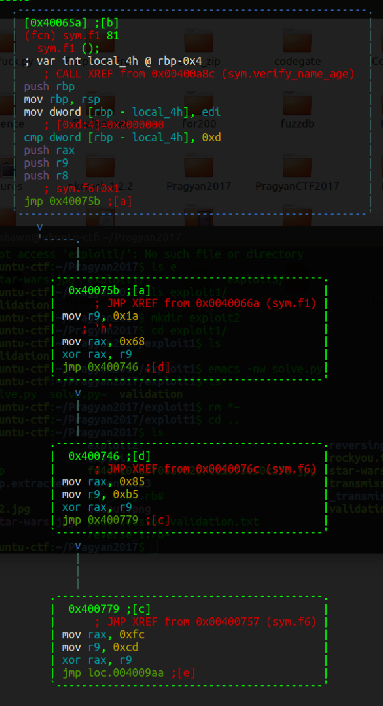

# Binary Exploitation Question 3
For this problem we were given a 64-bit ELF binary. After not finding any paraticularly interesting strings I looked at it and radare. I saw the main function called a verify_name_and_age function. This function took in the inputted age as a parameter and then called an f1 function. This function is below:

I noticed afted I performed a couple of the xor operations I was slowly printing out leet speak words so I decided to write a small [script](solve.py) to be used in gdb-peda to extract rax after each xor operation.I Set a breakpoint at function f1 and once I reached that breakpoitn ran my script and got the flag.

pragyanctf{r01l+th3m_411-up/@nd~4w@y}
