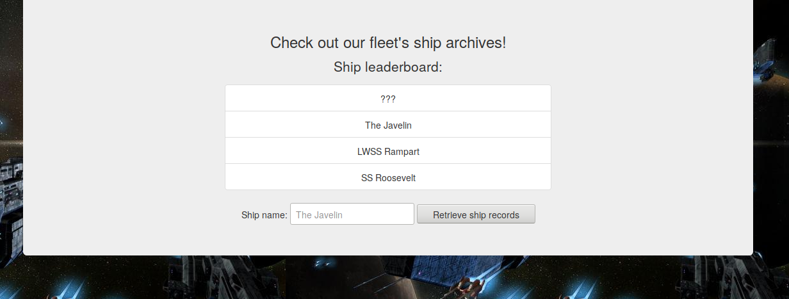
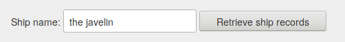
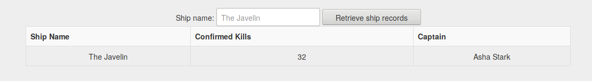
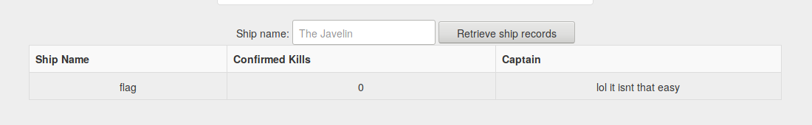
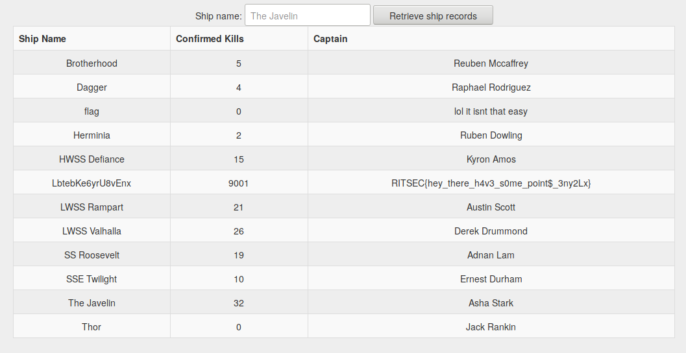

# Web 100 Writeup
This is a simple SQL injection challenge.

When the user goes to the website, they will be greeted with a neato webpage.


If a user tries to search for one of the listed ships...


...then they will get some information about the ship.


Simply searching for "flag" won't get you anywhere.


But if you do some SQLi, you can list all the ships!


There are a variety of ways to perform the SQL injection, but the string I used
was `' or 1=1; -- ` (note the space following the `--`).  Line 25 of index.php
shows the vulnerable SQL query:

```php
$result = $conn->query("SELECT * FROM spaceships WHERE name='" . $_POST['name'] . "';");
```