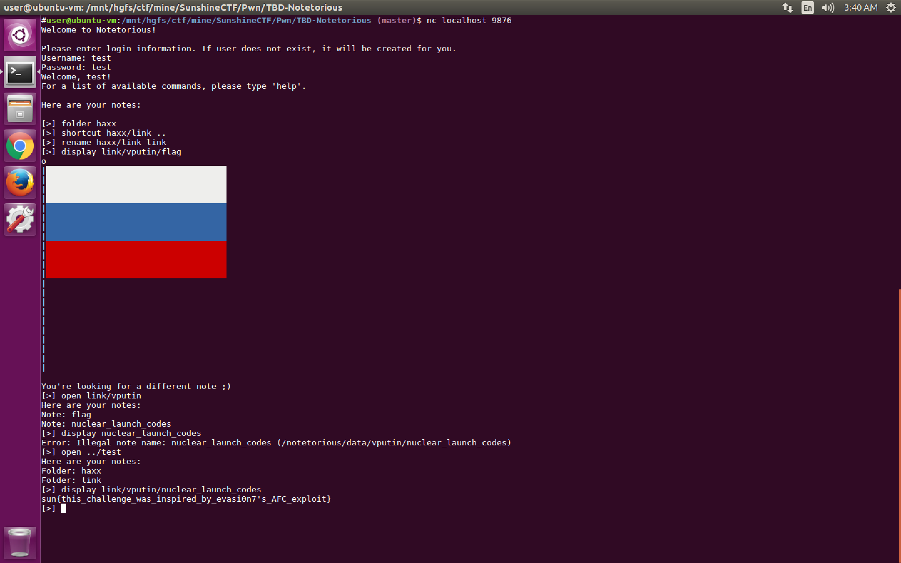

# [Pwn 200] Notetorious

Inspired by evasi0n7's AFC sandbox escape exploit [writeup by Geohot](http://geohot.com/e7writeup.html).

## How It Works

Players are given a netcat command to connect to the Notetorious service. They are presented with an interactive interface that first asks for a username and password and then processes commands. Players can list notes and folders (`list`), create notes (`compose`), read notes (`display`), delete items (`delete`), rename items (`rename`), create folders (`folder`), open folders (`open`), and create shortcuts to things (`shortcut`). The user is allowed to run these commands in the confines of their sandbox (`/notetorious/data/<username>/`). All commands check their arguments to ensure they operate within the sandbox.

## Deployment

`./deploy.sh`

## Maintenance

I tried to setup the permissions in such a way that players cannot interfere with anything critical. If something breaks, simply redeploy the Docker container by running `./deploy.sh` again. This will erase all data.

## Intended Solution

While shortcuts (implemented with symbolic links) are validated upon creation that their link target is within the sandbox, they are not revalidated during rename. Since symbolic links can be relative, one solution is presented below:

